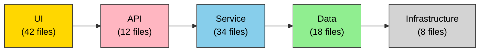

# Architecture Analysis Report

Generated: 2026-03-15 14:23:45
Project: ecommerce-api
Path: /projects/ecommerce-api

## Project Summary

| Metric | Value |
|--------|-------|
| Total Files | 147 |
| Lines of Code | 24,583 |
| Primary Languages | TypeScript, Python |
| Frameworks | Express.js, React, PostgreSQL |

## Architecture Quality Score

### Overall Score: **72/100**

Component Breakdown:

- **Modularity**: 78/100 (weight: 40%)
  Measures appropriate module boundaries and single responsibility principle adherence

- **Coupling**: 65/100 (weight: 25%)
  Evaluates interdependencies between modules; lower coupling is better

- **Cohesion**: 72/100 (weight: 20%)
  Assesses how closely related functionality is grouped together

- **Layering**: 68/100 (weight: 15%)
  Checks adherence to architectural layer separation

## Anti-Patterns Detected

Found **3** anti-pattern(s):

### X God Class [CRITICAL]

**Location**: `src/services/UserManager.ts`

**Description**: Class with 834 lines and 16 methods violates single responsibility principle

**Suggestion**: Consider splitting into smaller, focused classes with specific responsibilities

**Metrics**:
- lines: 834
- methods: 16

### W Circular Dependency [HIGH]

**Location**: src/utils/auth.ts -> src/services/cache.ts -> src/utils/auth.ts

**Description**: Circular dependency detected: auth.ts -> cache.ts -> auth.ts

**Suggestion**: Refactor code to break the circular dependency using dependency injection or intermediate abstractions

### o Leaky Abstraction [MEDIUM]

**Location**: `src/models/Database.ts`

**Description**: Exports 12 internal types that should be private

**Suggestion**: Use private/internal access modifiers and facade patterns to hide implementation details

**Metrics**:
- exportedInternalTypes: 12

## Architectural Layers

### API Layer

Handles external interfaces and routing

**Files**: 12
```
src/routes/users.ts
src/routes/products.ts
src/routes/orders.ts
src/routes/auth.ts
src/middleware/errorHandler.ts
... and 7 more files
```

### Service Layer

Business logic and orchestration

**Files**: 34
```
src/services/UserService.ts
src/services/ProductService.ts
src/services/OrderService.ts
src/services/PaymentService.ts
src/services/NotificationService.ts
... and 29 more files
```

### Data Layer

Database access and persistence

**Files**: 18
```
src/repositories/UserRepository.ts
src/repositories/ProductRepository.ts
src/repositories/OrderRepository.ts
src/models/User.ts
src/models/Product.ts
... and 13 more files
```

### UI Layer

User interface components and views

**Files**: 42
```
src/components/Header.tsx
src/components/ProductCard.tsx
src/components/CartItem.tsx
src/pages/Home.tsx
src/pages/Product.tsx
... and 37 more files
```

### Infrastructure Layer

Configuration and setup

**Files**: 8
```
config/database.ts
config/logging.ts
config/cache.ts
scripts/migrate.ts
docker-compose.yml
... and 3 more files
```

## Architecture Diagram

Type: layer



## Refactoring Suggestions

### CRITICAL Priority

1. **God Class**
   Split UserManager into Repository, Service, and Manager classes following single responsibility principle
   Impact: Addressing this God Class will improve overall architecture score

### HIGH Priority

1. **Circular Dependency**
   Break circular dependency between auth and cache modules using dependency inversion
   Impact: Addressing this Circular Dependency will improve overall architecture score

2. **Reduce Coupling**
   Use dependency injection and invert control to reduce module interdependencies
   Impact: Can improve coupling score by 15-20 points

### MEDIUM Priority

1. **Leaky Abstraction**
   Hide internal database types behind facade pattern
   Impact: Addressing this Leaky Abstraction will improve overall architecture score

2. **Improve Cohesion**
   Group related functionality closer together; consider extracting utility modules
   Impact: Can improve cohesion score by 10-15 points

---

## Key Takeaways

This e-commerce API demonstrates a reasonable architectural foundation with good modularity and separation of concerns. The main areas for improvement are:

1. Breaking down the oversized UserManager class (critical issue)
2. Resolving circular dependencies in the utility and cache modules
3. Tightening module coupling through better dependency management
4. Hiding internal implementation details from public APIs

Implementing these suggestions could bring the overall score from 72/100 to approximately 85-90/100, achieving a highly maintainable and scalable architecture.

**Estimated Effort**: 3-4 weeks for a team of 2-3 developers
**Expected ROI**: Significantly improved code maintainability, reduced future technical debt, easier testing
